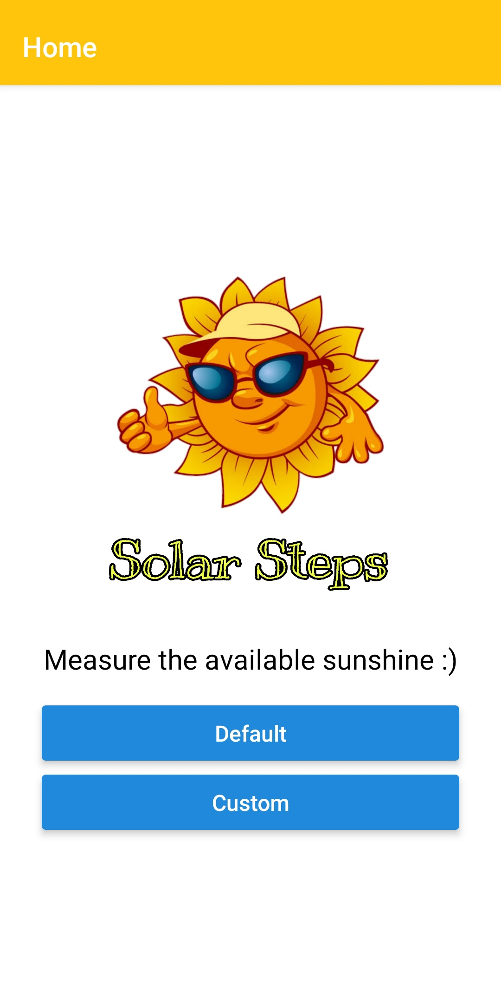
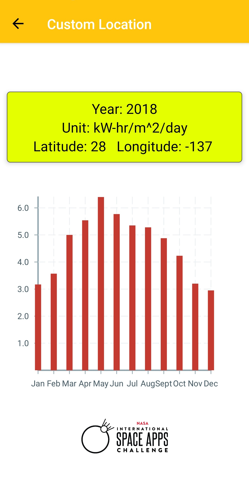

# SolarDrops

SolarStep is a mobile application (for both Android and iOS users) that provides a graphical display of available sunshine in a particular location and for a particular period (year).

## Download APK

[APK](https://drive.google.com/file/d/1q9sG9LWpXw5eQc5KMRh5llIuyn5zgOYf/view?usp=sharing)

## PPT Link

[Google Slide](https://docs.google.com/presentation/d/18XTtvTAar9vpMbOdGJNrJfuC7_lya88Gac9c6RfdB4w/edit?usp=sharing)

## Screenshots

## Features

- Month vs Available Sunshine( in kW-hr/m^2/day unit) histogram will be displayed based on the user input.
- Users can use their coordinates (with location permission) and the previous year (2020) as default input.
- Users can also use a custom latitude, longitude to get the graphical view. 
- Users can use any custom year from 1981 to 2020. 
- This app is available for both Android and iOS users.

## Impact

NASA produces a variety of surface solar and meteorological data parameters that are useful to commercial renewable energy and sustainable building ventures, but this information is not easily accessible to the typical homeowner. Now users can easily get a graphical overview of available sunshine in any particular place and they can make any future decisions without any doubt.  

## Tools & Technologies

- React Native
- Expo
- Victory Native
- NASA POWER API

